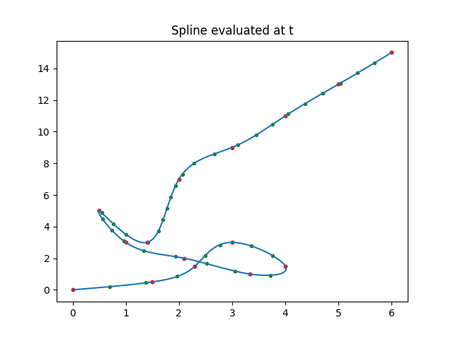

# Cubic Multithreaded Spline Interpolator

A high-performance, multithreaded cubic spline interpolation library designed as an alternative to Eigen's Spline interpolation.

## Overview
This repository contains a C++ implementation of a cubic spline interpolator, designed to be a fast alternative to Eigen's spline interpolator. The class `CubicMultithreadedSpline` leverages multithreading to provide efficient spline calculations, making it particularly suitable for large data sets with thousands of points.

## Motivation
Eigen's Spline interpolator tends to slow down as the number of points increases, especially for large datasets. This implementation is aimed at addressing this performance bottleneck.

## Features
- Multithreaded for better performance
- Utilizes Eigen library for mathematical operations
- Uses OpenCV for basic types (e.g., `cv::Vec3d`, `cv::Vec2d`)
- Able to interpolate curves defined by scalar functions \( f(t) = (x(t), y(t)) \) for \( t \) ranging from 0 to 1

## Dependencies
- Eigen
- OpenCV
- GSL (GNU Scientific Library)
- Python3.8 (For example plotting)
- pthread (POSIX threads library)
- matplotlibcpp

#### Matplotlib for C++

Install the needed dependencies and paste `matplotlibcpp.h` into this repository. You can find it at [matplotlib-cpp GitHub Repository](https://github.com/lava/matplotlib-cpp).

## Installation
To compile the example:

```bash
g++ -std=c++17 -g -o example example.cpp CubicMultithreadedSpline.cpp -I /usr/include/eigen3 -I/usr/include/python3.8 -I/usr/include/opencv4 -lpython3.8 -lgsl -lgslcblas -lpthread -lopencv_core
```

## Example Usage
Check the `example.cpp` file for a complete working example. Here's a snippet:

```cpp
// Data generation
Eigen::VectorXd x(15), y(15);
x << 0, 1.5, 2.3, 3, 4, 3.333, 2.1, 1, 0.5, 1.4, 2, 3, 4, 5, 6;
y << 0, 0.5, 1.5, 3, 1.5, 1, 2, 3, 5, 3, 7, 9, 11, 13, 15;

CubicMultithreadedSpline spline(x, y);

// Evaluate spline at t=0.5
Pixel p_t = spline(0.5);
```



## API Reference
The primary class provided by this library is `CubicMultithreadedSpline`.

### Constructors
- `CubicMultithreadedSpline()` : Default constructor
- `CubicMultithreadedSpline(const VectorXd& x, const VectorXd& y)` : Constructor to initialize with Eigen::VectorXd
- `CubicMultithreadedSpline(const std::vector<Voxel>& vs)` : Constructor to initialize with a vector of Voxels (cv::Vec3d)

### Methods
- `Pixel operator()(double t) const` : Evaluate the spline at a given value of \( t \)

<a name="todo"></a>
## TODO

- The spline, as of the current implementation, is not perfectly differentiable. This is due to the function `windowed_spline_with_buffer_multithreaded` not stitching the border segments properly. Specifically, the border segments are not recomputed with the exact derivatives at the end points, which leads to a slight discontinuity.

## Contributing
Contributions are welcome! Feel free to open issues for bugs or new features, and submit pull requests. Check out the [TODO section](#todo)!

## License
This project is open-source, available under [MIT License](LICENSE).